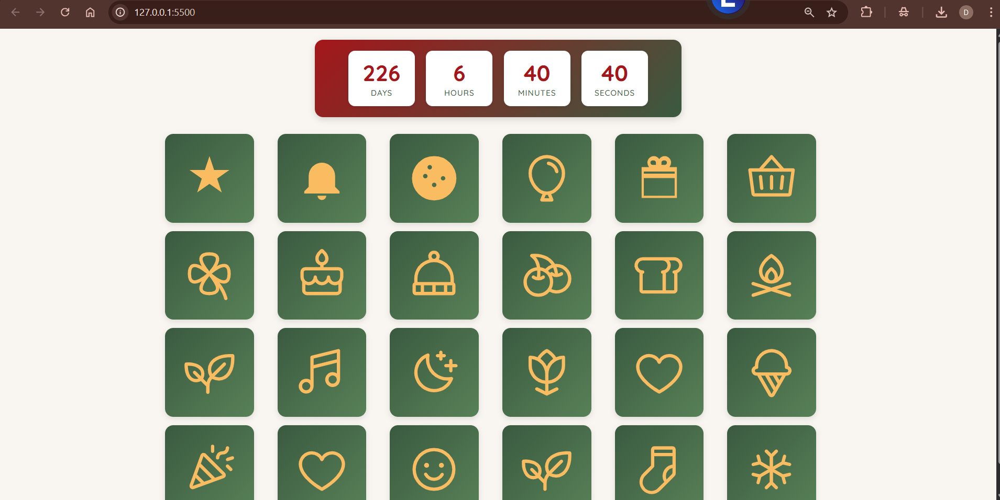
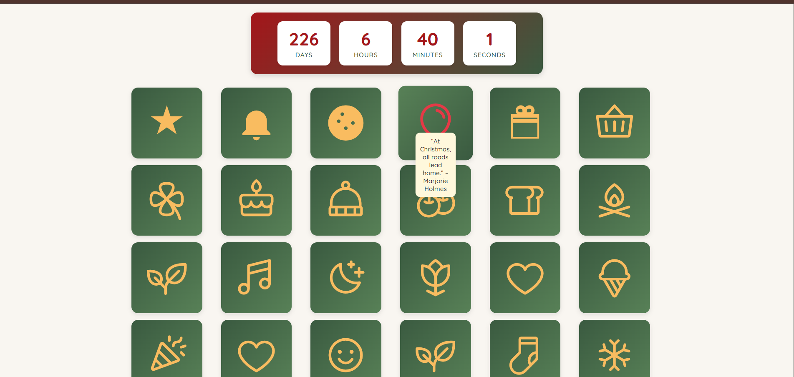

# 🎄 Christmas Calendar

A fun and festive web application that lets users count down the days to Christmas! This Christmas Calendar features interactive windows behind which are hidden surprises. 

## ✨ Features

- **Inspiring Quote Surprises** 
- **Interactive Interface** — Clickable icons

## 🛠️ Tech Stack

- **Frontend:** HTML, CSS, JavaScript
- **Backend (optional):** Javascript
- **Deployment:** GitHub Pages

#  🎁 How It Works

1. The calendar is a grid of 24 tiles, one for each day leading up to Christmas (December 1–24).

2. Each tile contains an icon that the user can click.

3. When the icon is clicked, a quote is revealed inside the tile.
 

## Screenshots

